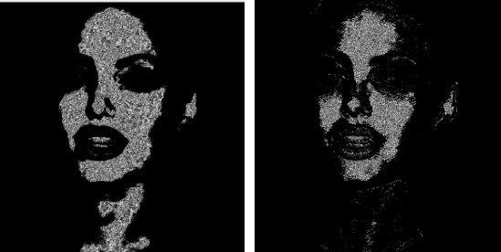

# DConvNet
Convolution Net.

I have spent quite a bit of time learning about convolutional networks, and have developed a lot of code, but most of this code is scattered around
aimless test projects that are better left on the computer. This project was created in order to collect all the developments and refine them,
but for now it is frozen and my further work with convolutional networks will also be presented in another project, more advanced.
This project contains the basic principles of convolutional networks:
layers, cores, convolution, pooling, parallel computing on the processor and parallel computing on the video card using OpenCL.

Many of my machine learning achievements can also be found in the DSynapse project.

I studied the behavior of convolutional networks on an image recognition problem. For the recognition problem, a convolutional network using its kernels
must successfully identify the main features in the images, from which sub-features will be identified in the future, and so on until the features are low enough
so that they can classify the image.
The convolutional network launched on the video card successfully identified features in the images
needed to recognize, for example, a person's face. For the test, I used a photo of Jolie.

In this comparison, you can see how the network highlights the silhouette of a face:

And here are other signs - the network highlights the contours of the face and eyes:

The inner part of the face is singled out as signs:

More contours:

